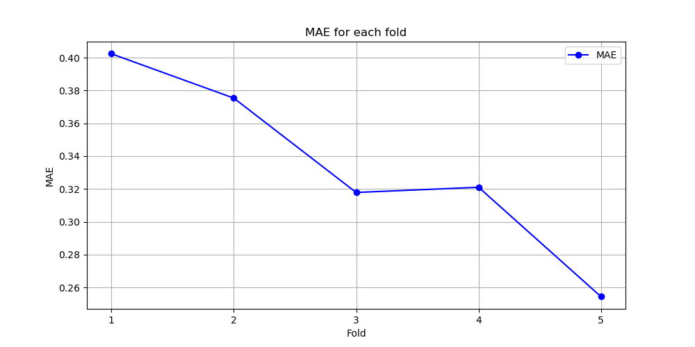
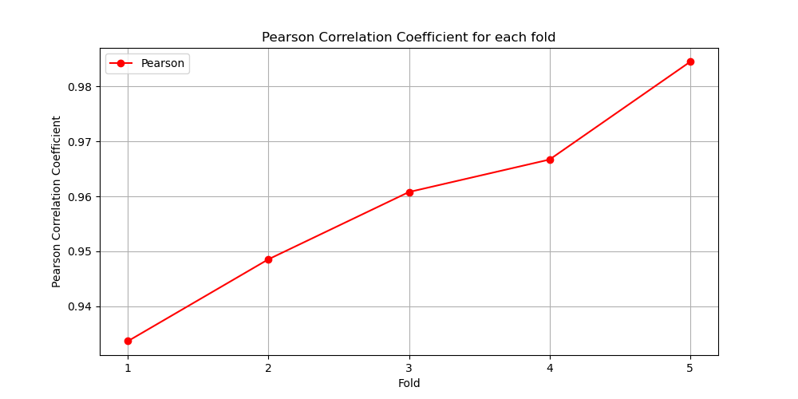

# Chinese-dimensional-sentiment-analysis
2024 NYCU Natural Language Processing

## Method

This method aims to leverage a set of six independently trained BERT-based models, each specializing in a different category. 

The final prediction is derived from the average of all model outputs, providing a robust and reliable estimate.

## Evaluation

Mean Absolute Error (MAE):

$$
  MAE = \frac{1}{n} \sum_{i=1}^n |a_i - p_i|
$$

Person Correlation Coefficient ($r$):

$$
  r = \frac{1}{n-1} \sum_{i}^n (\frac{a_i - \mu_A}{\sigma_A})(\frac{p_i - \mu_P}{\sigma_A})
$$

- $a_i \in A$: $i$-th actual value
- $p_i \in P$: $i$-th predicted value
- $\mu$: mean value
- $\sigma$: standard deviation
- $n$: the number of test sample

A lower MAE and a higher r indicate more accurate prediction performance.

## Experiment

### Dataset

- Training Dataset: Chinese EmoBank (CVAT)
- Testing Dataset: 1000+ Mental Health Texts

### On Chinese EmoBank (CVAT) with Bert

  <table>
    <tr>
      <th>
        Method
      </th>
      <th>
        MAE
      </th>
      <th>
        r
      </th>
    </tr>
    <tr>
      <td>
        Valence
      </td>
      <td>
        0.30344
      </td>
      <td>
        0.95852
      </td>
    </tr>
    <tr>
      <td>
        Arousal
      </td>
      <td>
        N/A
      </td>
      <td>
        N/A
      </td>
    </tr>
  </table>

> Valence

> Arousal

### On private dataset with Bert

|Method|MAE|r|
|--|--|--|
|Valence|||
|Arousal|||

### On Chinese EmoBank (CVAT) with MoE Bert

### On private dataset with MoE Bert

## Reference

- [bert-base-chinese](https://huggingface.co/google-bert/bert-base-chinese)
- [Chinese EmoBank: Building Valence-Arousal Resources for Dimensional Sentiment Analysis](https://dl.acm.org/doi/full/10.1145/3489141)

